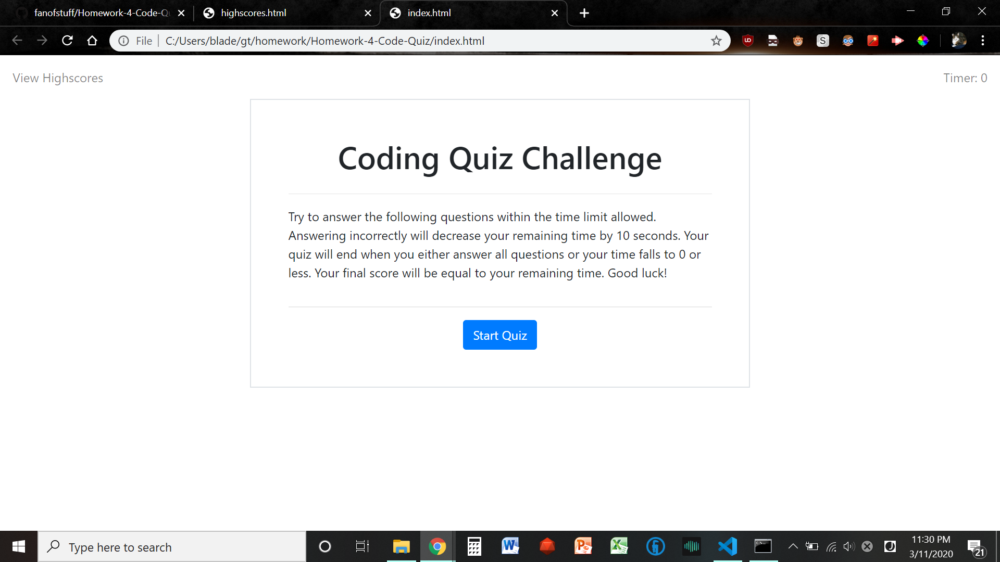
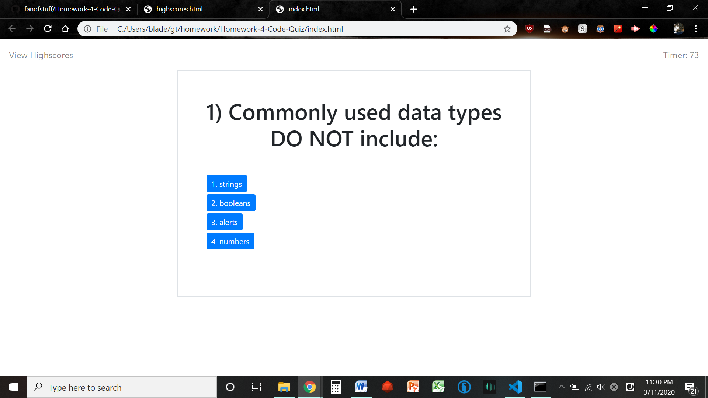
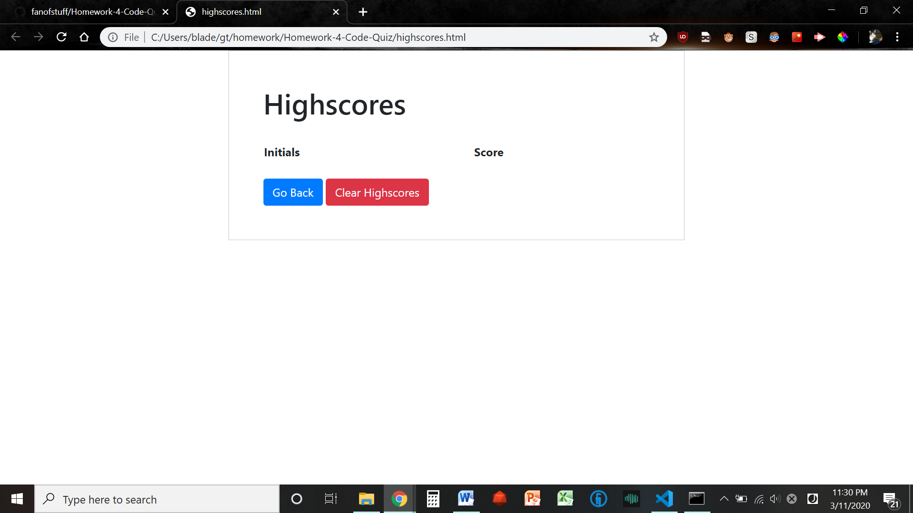
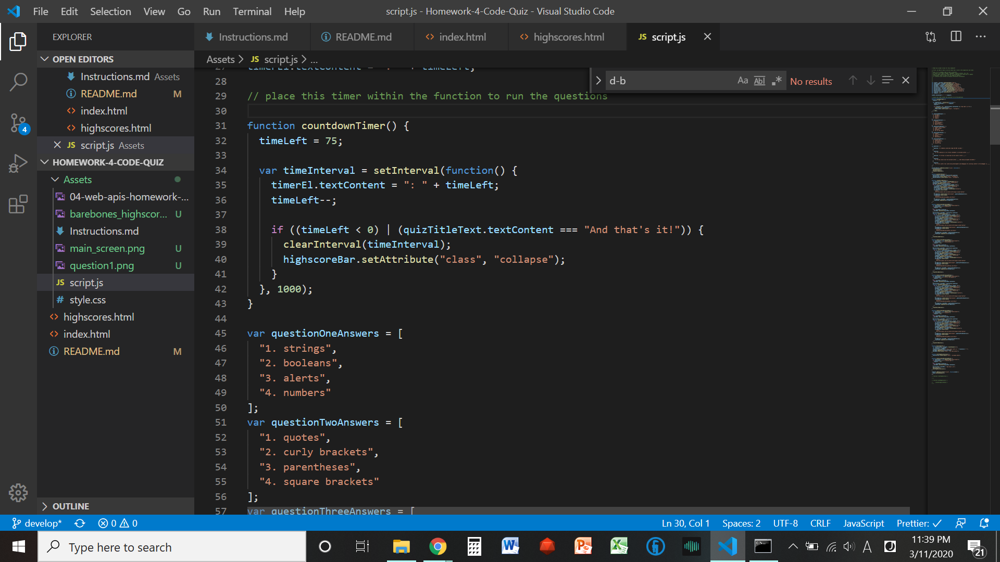

# Homework-4-Code-Quiz

This program is intended to provide a short and easy quiz regarding common javascript-related questions that one might potentially face in an interview. Notably, this quiz comes with a time limit and an associatated penalty for missed questions, reducing your overall time remaining and final score by 10 points per miss. 

## Intended Usage

According to the user story that came bundled with this project, the intent of this program is to create a simple quiz that the user can then test themselves with. Do note, however, that all of this information is stored in plain text - if they wanted to, the user could just look up the answers with the inspector tool. 

## Screenshots

## Features

- Questions and buttons generated following each button selection using javascript, with no JQuery
- 5 selected Javascript-related questions 
- A timer that counts down at 1/second, but which also decreases by 10 when questions are missed. 

## Link to Published Page

(https://fanofstuff.github.io/Homework-4-Code-Quiz/)

## Example

## How to Use

1. Open up index.html
2. Click Start Quiz
3. Select an option that best answers the question displayed
4. Repeat 5 times, or until your time runs out
5. Enter in your initials to go along with your highscore, and then press submit (WIP)
6. View your highscores on the linked page at any time (WIP)
## Credits

© 2019 fanofstuff